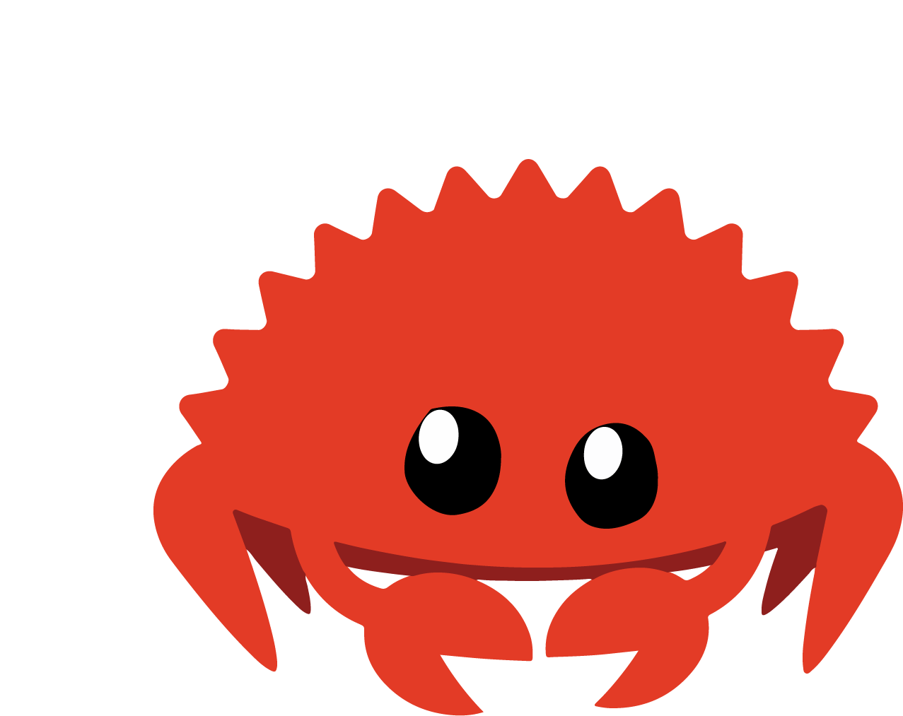
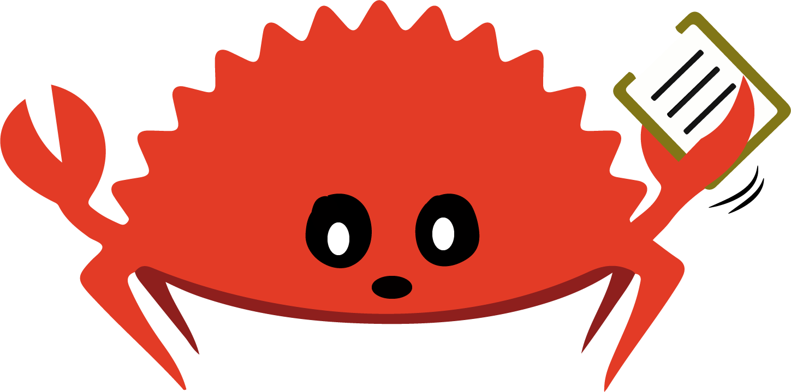
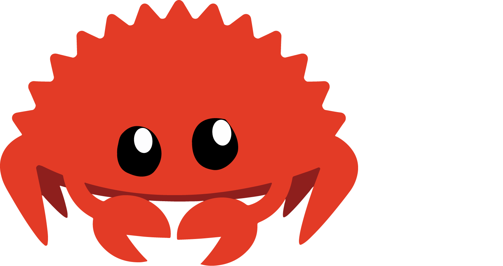

    <h1>Proyecto Analizador de Código Rust </h1>

### Materia: Lenguajes de Programación  
### Grupo 10  

---

    <h2>Integrantes </h2>

<ul>
    <li>Sebastián Holguin Vargas</li>
    <li>Derian Baque Choez</li>
    <li>Carlos Ronquillo Brush</li>
</ul>

---

    <h2>Descripción del Proyecto </h2>

    Este proyecto consiste en un analizador de código Rust que realiza análisis léxico, sintáctico y semántico. Utiliza la librería PLY de Python junto con Lex y Yacc para llevar a cabo el análisis del léxico, la sintaxis y la semántica del código en Rust.

---

    <h2>Requisitos </h2>

<ul>
    <li>Python 3.12.6</li>
    <li>PySide6</li>
    <li>PLY</li>
</ul>

---

    <h2>Instalación </h2>

1.- Desde la raíz del proyecto ejecute:

<pre><code>pip install -r requirements.txt</code></pre>

---

    <h2>Uso </h2>

Para ejecutar el programa, simplemente ejecute el archivo <code>main.py</code>:

<pre><code>python main.py</code></pre>

---

<h2>Ejecutable</h2>

También puedes descargar el ejecutable en el siguiente enlace:

[Descargar Ejecutable](https://github.com/Sebhvarg/LP_GUI/releases/download/v1.0/app.exe)

Compatible con Windows

---

Desarrollado por esttudiantes de la Escuela Superior Politécnica del Litoral (ESPOL)

